# Lab 1 - Adding a new API Specification

In this lab, we'll import an OpenAPI (fka Swagger) model into the Apigee Edge platform. To begin, select the *Specs* option from the Apigee Management UI Dashboard:

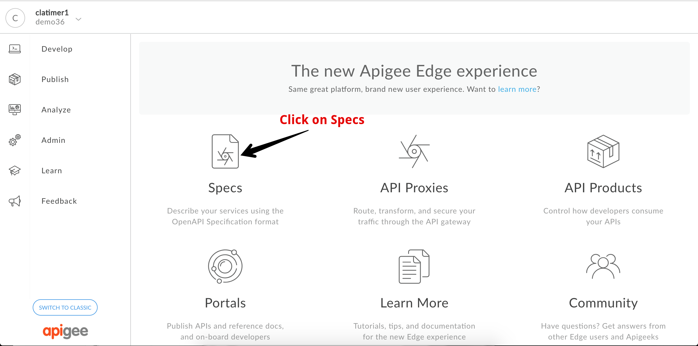 

Expand the *+Spec* button and select the option *Import URL...*

 

This will reveal a dialog to import a new spec from a URL. In this dialog, copy and paste this URL into the URL field:  <a href="http://playground.apistudio.io/7c8a02f4-6ed8-44a0-8c46-80e00cdd85cf/spec" target="_blank">http://playground.apistudio.io/7c8a02f4-6ed8-44a0-8c46-80e00cdd85cf/spec</a>

 

Click on *Import* to import the specification into your API Specification collection. Once you do this, you will see the API specification in the list of specs. 

 

Click on your spec to launch the spec editor tool. The spec editor allows you to edit the yaml that defines the spec and see a preview of your API documentation in one view. On the right hand pane you can familiarize yourself with the API we'll be working with. The API has two resources:

`GET /orders` is used to search for orders. You can specify a custId query parameter to find orders for a given customer.

`GET /orders/{orderId}` is used to retrieve a specific order by providing an orderId.

In the editor pane, update the specification to provide a more descriptive title:

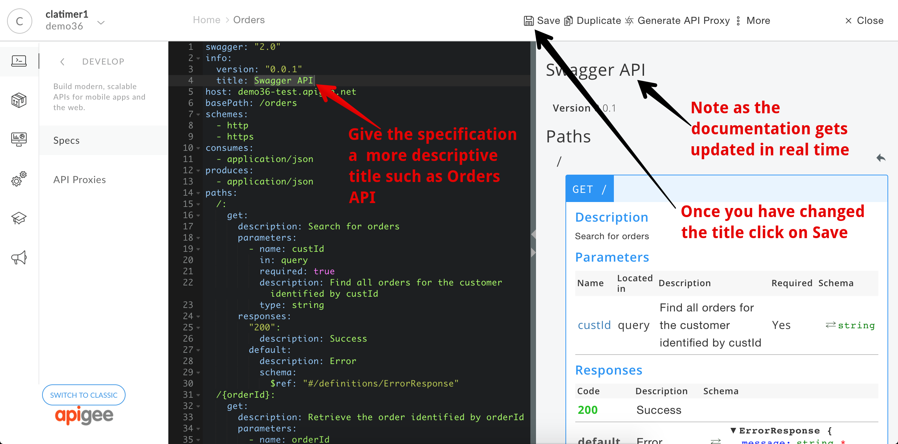 

Click on the *Save* link to save the changes to your specification. Once the Spec has successfully saved, you can then create an API Proxy by clicking on the *Generate API Proxy* option:

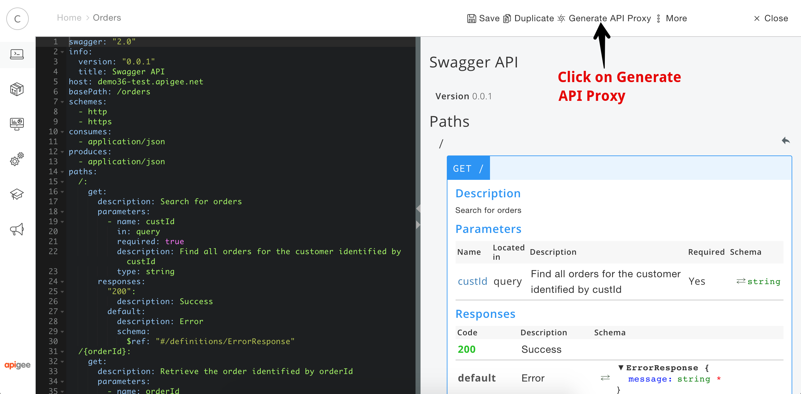

This will launch the API Creation wizard that walks you through the process of creating an API Proxy. On the first form, give your API Proxy a name of `{yourLDAP}-orders-rest-api` and specify a base path value of `/{yourldap}-orders` then click next:

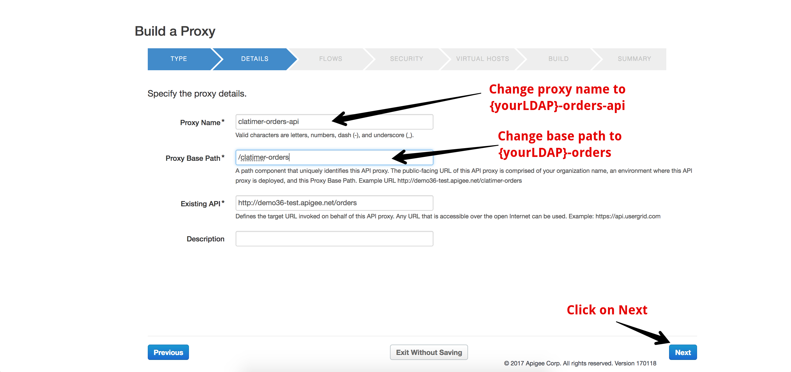

The next screen will allow you to select a subset of the resources from the specification that you want to expose through your API proxy. Leave the default values and click next:

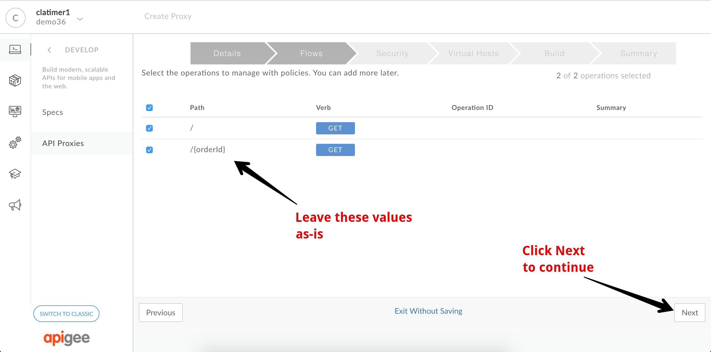

The next screen allows you to setup common security approaches and add CORS headers. Select the pass-through option and leave CORS unchecked:

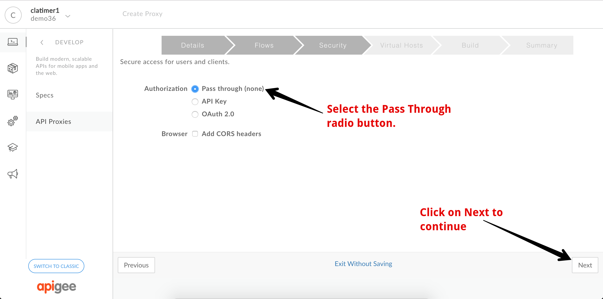

The next screen allows you to map the API to certain virtual hosts. Your organization will have fewer virtual hosts than what are shown in the image. Just leave the default values and click next:

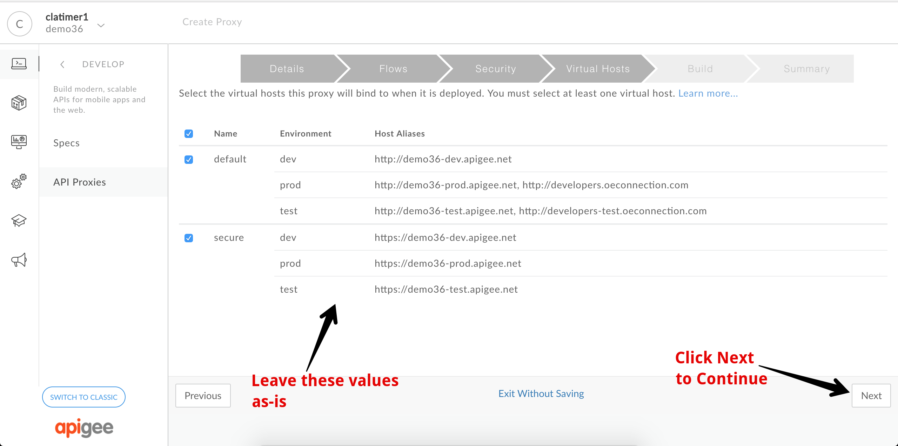

The final screen gives you an option to review your API Proxy configuration and deploy it to one or more environments. Leave the default values and click on *Build and Deploy*:

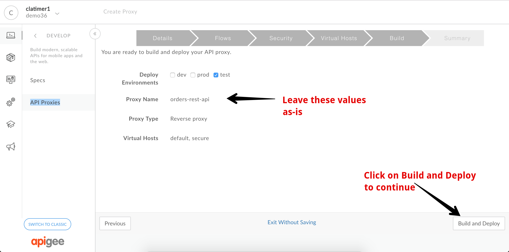

Once the API Proxy has been built and deployed, you will see a confirmation and a link to open the API Proxy for further development. Click on the *orders-rest-api* link:

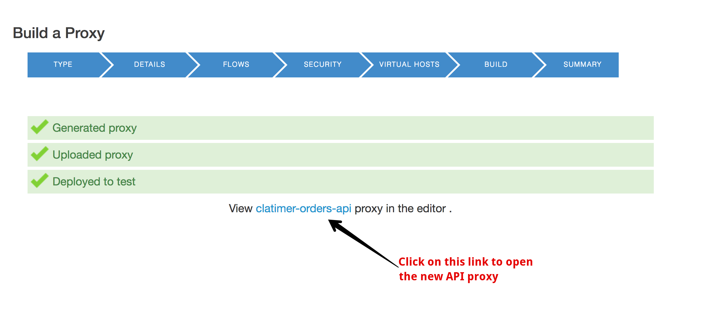

This will take you to the Proxy Overview page for your API Proxy:

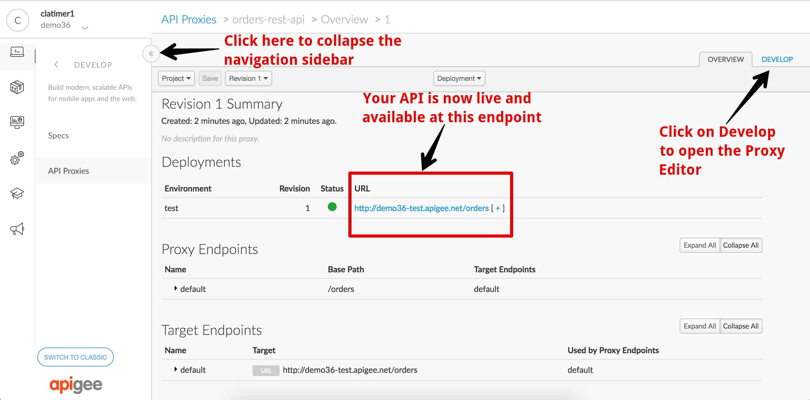

Click on the << icon as shown above to collapse the expanded sidebar and reveal more of the API Proxy view. As also shown, you can navigate to the Develop tab to view the Proxy Editor. This is the view we will use to add new features and capabilities to our API:

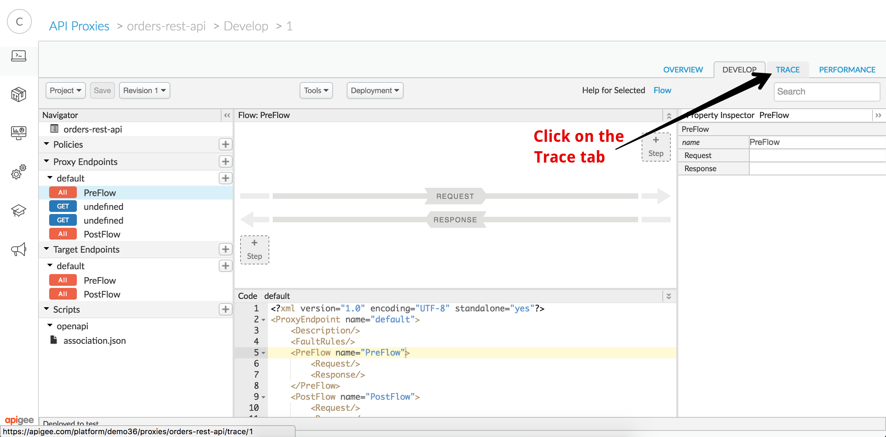

Click on the Trace tab to open the Trace tool. Here we can verify that we can access our API through Apigee. Start by clicking on the *Start Trace Session* button:

Once the trace session has been started, Apigee Edge will automatically capture information on each API call made to your API proxy. Verify this is working by sending API calls as shown in the following screen captures:

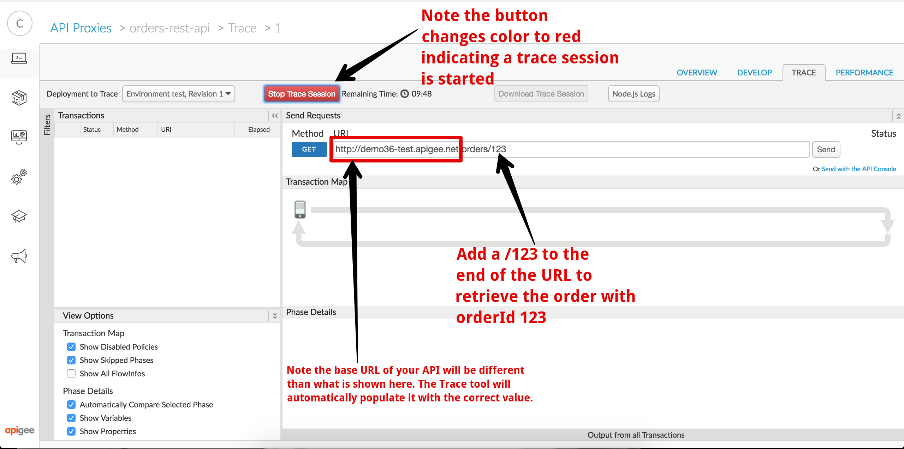

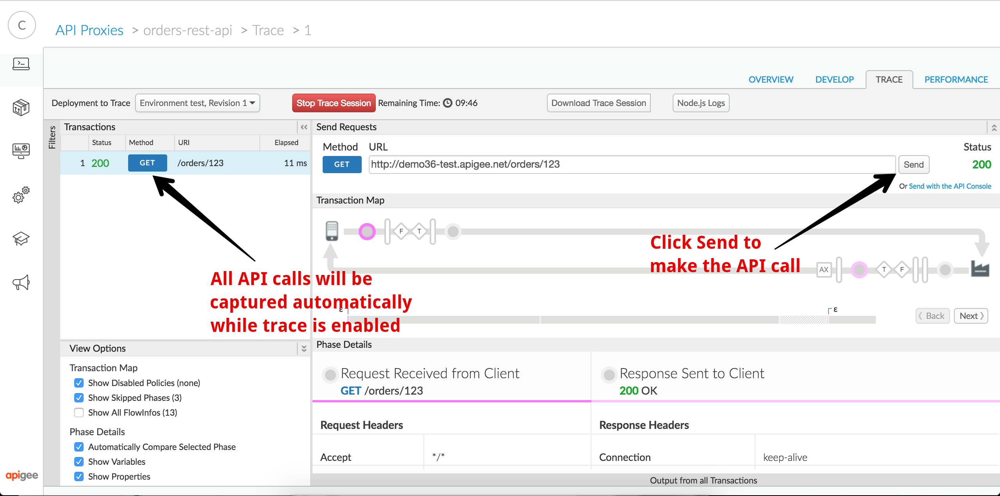

If you see your API calls displayed in the left panel and see a response code of 200 next to each call, congratulations, you've successfully created your first API proxy in Apigee Edge! You've also successfully completed lab 1!

# Up Next

Now that you've successfully imported an API specification and used it to create an API Proxy you're ready to add features such as traffic management and security. 

When you're ready, you can get started on [Lab 2 - Traffic Management and Basic Security](lab2.md).
