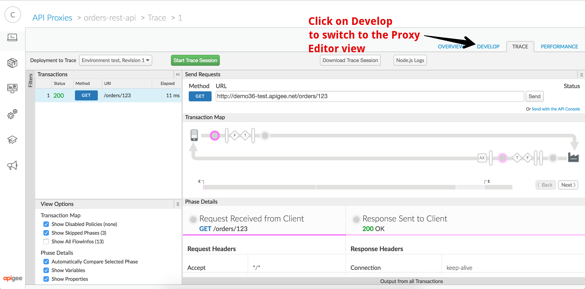
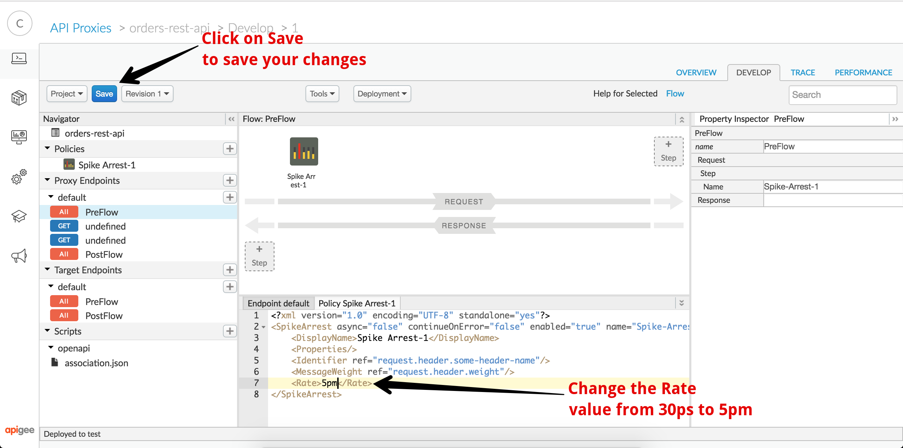
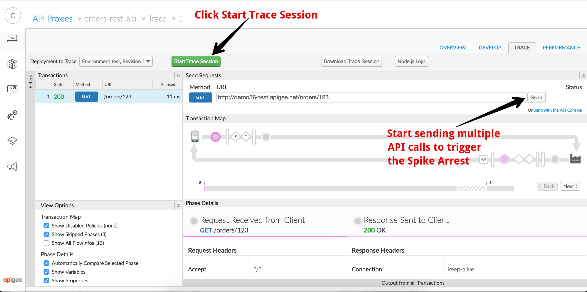
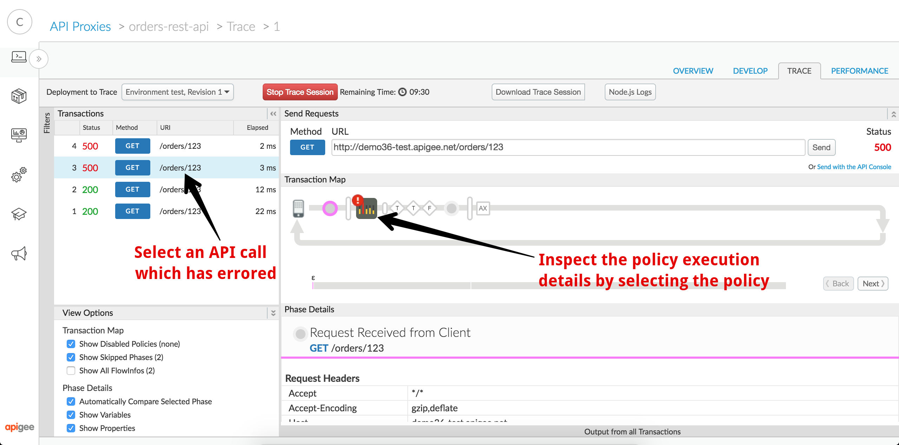

# Lab 2 - Traffic Management and Basic Security

This lab builds upon the work we did in [lab 1](lab1.md). In this lab, we will take the pass-through API Proxy that we created in lab 1 and add two new capabilities: a Spike Arrest to throttle traffic and an API Key validation for a very basic layer of security.

Start by opening up the API Proxy editor by clicking on the develop tab:

Once in the API Proxy editor, you can click on the *+Step* button in the top right to add a new policy to your API Proxy:

This will launch a dialog box that you can use to add a number of policies to your API Proxy. In this case, you're going to select the Spike Arrest policy from the list and click on *Add* to attach the poicy to the request pipeline of your API Proxy:

By default the Spike Arrest policy is configured to throttle traffic when incoming API calls exceed a frequency of 30 calls per second. Because this is difficult for us to test, we'll modify the XML configuration for the policy to set the rate to 5 per minute:

Once you have made the modification, click on the blue Save button to save and deploy your changes. Once you see the confirmation that your API Proxy was saved successfully, click on the trace tab so we can test the Spike Arrest:

Just as in lab 1, start a new trace session by clicking on the *Start Trace Session* button. You can then start sending in a series of API calls to trigger the Spike Arrest:

After a few calls you should be able to observe that the API proxy starts to throttle your API calls:

