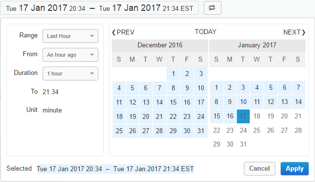
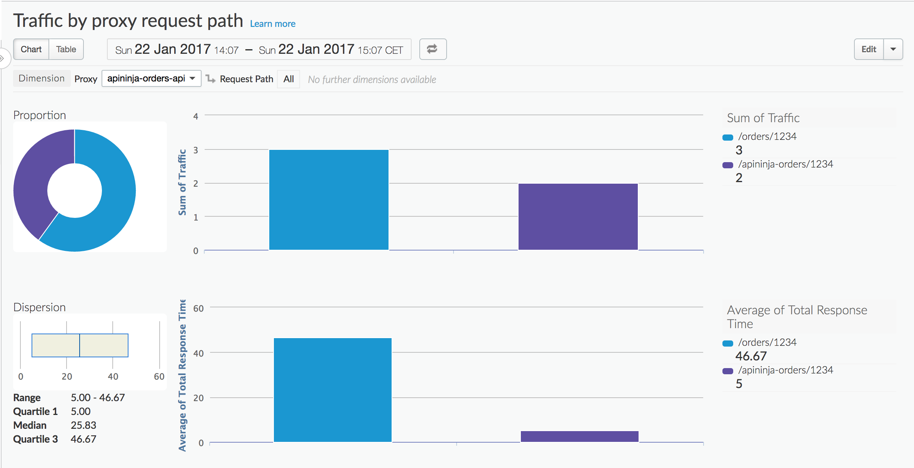

# Lab Appendix 1 - Custom Reporting

Let's say your API has gained wide adoption. It's popular. You have attracted a number of talented, creative app developers and people are downloading and installing their apps. The API team is very interested in how the API is performing, how it's being used, and how to plan for improvements. 

## How can Apigee Edge help?
Apigee Edge Analytics Services collects and analyzes a wealth of information that flows through APIs. This information is gathered, analyzed, and provided to you immediately, in real time. In this lab we will see how you can extend the Edge analytics services by create dimension and metrics and use them in Custom reports.

### Custom Reports 
There are several out-of-the-box, standard reports that are automatically provided for every Edge organization. They track several critical operational metrics, such as proxy response time, target response time, cache performance, error rates, and others. An API Publisher can create custom reports to augment the standard reports. By adding custom reports, you can create a set of charts that provide insight into the exact aspects of your API program that you wish to analyze.

In this lab, you will create a custom report to provide insight into the consumption of your APIs.

## Pre-requisites
* An existing API proxy
* Traffic to API Proxy

## Instructions

### Navigate to the Analytics section of Edge

* Go to [https://apigee.com/edge](https://apigee.com/edge) and log in. This is the Edge management UI. 

* Select **Analyze → Reports** in the side navigation menu.

 

### Creating a Custom Report
* Click **+ Custom Report**.

* Enter the **Report Name** and **Report Description**.

 

* Select a chart type, **Column**. This is the style of chart that will be used to present your custom analytic data.

* In the Metrics sections, choose the metric that you wish to analyze. Select **Traffic** as the metric. See [Custom Metrics](https://docs.google.com/document/d/1T33fq5q5D6z7nmxI7gcKtcIcNvOxbuIv_BO8DWWthis/edit#heading=h.ksg236njnyhd) for a description of each metric.

* Select an **Aggregate Function** that you want applied to the data for the first metric. You can select an aggregation function to display the **Sum**, **Average**, **Min**, or **Max** values. Select **Sum** as the Aggregate Function. 

* (Optional) Click **+ Metric** to add additional metrics. Select **Total Response Time** as the metric and Average as the **Aggregate** Function.

* Click on the **Dimension** dropdown and select **Proxy**. Every dimension you add (by clicking **+ Dimension**) constrains the data set used to generate the reports. In effect, you're presenting more and more specific data with each drill down. 

 

* Add an additional **Dimension** for **Request Path**.

* You can further narrow the data displayed by adding filters to your report definition. In the **Filter** section of the page, click **+ Filter Condition**. Select Proxy as the entity you want to filter on, select = as the **Operator** and set the **Value** to your API Proxy name (e.g. “ap_employees”).

* Click on the check button under Actions to save this filter.

* Click **Save**. 

\*\* **Note: Data delay interval** - After API calls are made to proxies, it takes about **10-15 minutes** for the data to appear in dashboards, custom reports, and management API calls.

### Viewing a Custom Report
Once you have saved the **Custom Report** you can view it immediately. You should see something similar to the following:

If no data is returned, verify that the timeframe of the **Custom Report** matches a timeframe where traffic was being sent to the API.

Also, verify that the appropriate **Environment** has been selected on the top right dropdown.

### Drilldown dimensions
You can select from a large number of custom drilldown dimensions. Drilldown dimensions let you specify which dimensions to measure in your custom report. Apigee Edge Analytics collects data on a wide range of dimensions. And, you can also select any custom dimensions that have been created in your organization. See [Analytics reference](http://docs.apigee.com/analytics-services/reference/analytics-reference).

To drill down into the custom report you just created, click on the name of your **Proxy** under the **Summary** on the bottom of the report.

You should now be able to view a drill-down into the **Request Path** dimension for your **API Proxy**.

 

### Editing and deleting your reports
When you've completed building your custom report, the data is populated immediately. The graph is defaulted to plot the first metric you chose for the tab in your custom report. If you want to see different metrics, or compare them against each other, follow these steps:

1. Click the report name to view the graphs of the selected report.
2. Click the Edit button to edit the display name, dimensions, and measures.
3. Click Save.

You also have the option to delete a report by clicking the **Delete** button.

## Summary

In this exercise, you learned about custom reports in Apigee Edge. You also added the custom report along with other reports to a custom dashboard. Please visit the documentation to see the different kinds of operational reports and dashboards that are available to you.